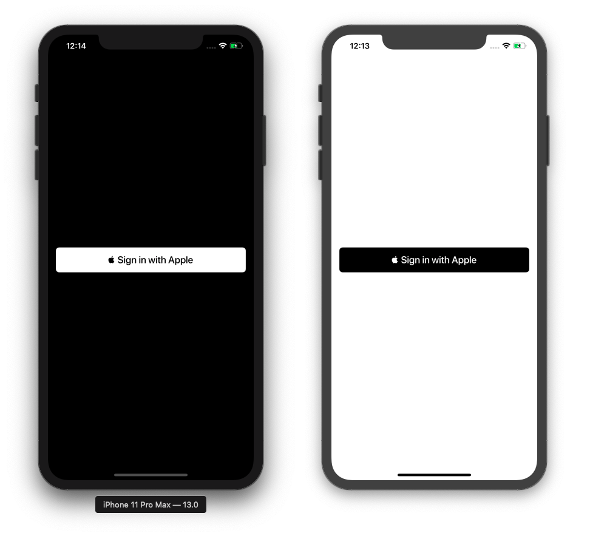

# Sign In With Apple Button for SwiftUI




## Installation with Swift Package Manager

Swift Package Manager is integrated within Xcode 11:

1. File → Swift Packages → Add Package Dependency...
2. Paste the repository URL: https://github.com/moifort/swiftUI-sign-in-with-apple-button.git


## Usage

```swift
import SwiftUI
import SignInWithAppleButton // Add import

struct ContentView : View {
    var body: some View {
        VStack {
            SignInWithAppleButton()
        }
    }
    
}
```
